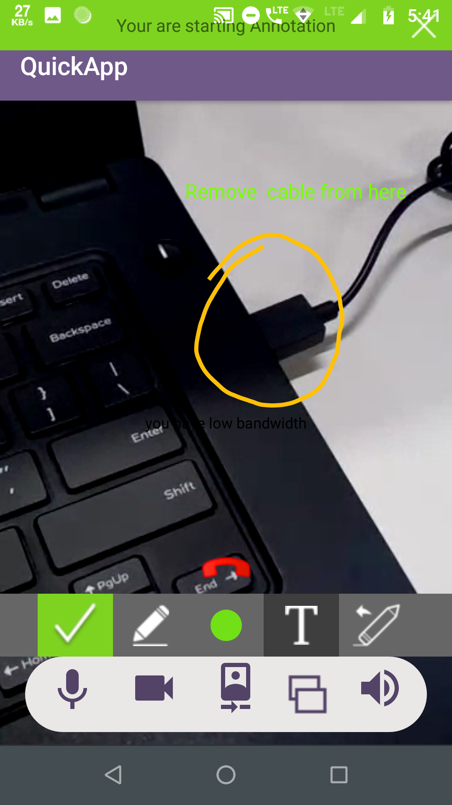
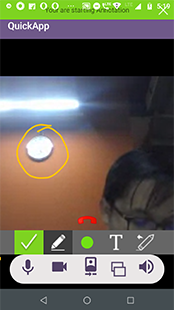
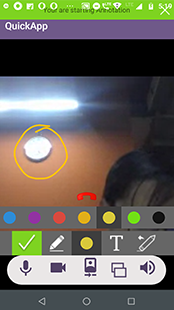
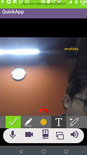

# 1-to-1 RTC Chat App: Web Application using Node.js & EnableX Web Toolkit

1-to-1 RTC: A Sample Chat App using Node.js & EnableX Web Toolkit

The Sample Web App demonstrates the use of APIs for EnableX platform to carry out 1-to-1 Chat Application. The main motivation behind this application is to demonstrate usage of APIs and allow developers to ramp up on app by hosting on their own devices instead of directly using servers.

RTC Applications hosted on EnableX platform run natively on supported set of web browsers without any additional plugin downloads.

This basic 1-to-1 Chat Application is developed using HTML, CSS, Bootstrap, JavaScript, jQuery, Node.js and EnxRtc (The EnableX Web Toolkit). 

> EnableX Developer Center: https://developer.enablex.io/

## 1. How to get started

### 1.1 Prerequisites

#### 1.1.1 App Id and App Key 

* Register with EnableX [https://portal.enablex.io/cpaas/trial-sign-up/] 
* Create your Application
* Get your App ID and App Key delivered to your email


#### 1.1.2 Sample Android Client 

* Clone or download this Repository [https://github.com/EnableX/1-to-1-Video-Chat-Android-App-Sample-With-Annotation.git] 


#### 1.1.3 Sample App Server 

* Clone or download this Repository [https://github.com/EnableX/One-to-One-Video-Chat-Sample-Web-Application.git ] & follow the steps further 
* You need to use App ID and App Key to run this Service. 
* Your Android Client End Point needs to connect to this Service to create Virtual Room.
* Follow README file of this Repository to setup the Service.


#### 1.1.4 Configure Android Client 

* Open the App
* Go to WebConstants and change the following:
``` 
 /* To try the App with Enablex Hosted Service you need to set the kTry = true When you setup your own Application Service, set kTry = false */
     
     public  static  final  boolean kTry = true;
     
 /* Your Web Service Host URL. Keet the defined host when kTry = true */
 
     String kBaseURL = "https://demo.enablex.io/"
     
 /* Your Application Credential required to try with EnableX Hosted Service
     When you setup your own Application Service, remove these */
     
     String kAppId = ""  
     String kAppkey = ""  
 ```
 
 Note: The distributable comes with demo username and password for the Service. 

### 1.2 Test

#### 1.2.1 Open the App

* Open the App in your Device. You get a form to enter the credentials i.e. Name & Room Id.
* You need to create a Room by clicking the "Create Room" button.
* Once the Room Id is created, you can use it and share with others to connect to the Virtual Room to carry out an RTC Session.
  
  Note:- In case of emulator/simulator your local stream will not create. It will create only on real device.
  
## 2. Server API

EnableX Server API is a Rest API service meant to be called from Partner's Application Server to provision video enabled 
meeting rooms. API Access is given to each Application through the assigned App ID and App Key. So, the App ID and App Key 
are to be used as Username and Password respectively to pass as HTTP Basic Authentication header to access Server API.
 
For this application, the following Server API calls are used: 
* https://www.enablex.io/developer/video-api/server-api/rooms-route/#create-room - To create new room
* https://www.enablex.io/developer/video-api/server-api/rooms-route/#get-room-info - To get information of a given Room
* https://www.enablex.io/developer/video-api/server-api/rooms-route/#create-token - To create Token for a given Room to get into a RTC Session

To know more about Server API, go to:
https://www.enablex.io/developer/video-api/server-api


## 3. Android Toolkit

Android App to use Android Toolkit to communicate with EnableX Servers to initiate and manage Real Time Communications.  

* Documentation: https://www.enablex.io/developer/video-api/client-api/android-toolkit/
* Download: https://www.enablex.io/developer/video-api/client-api/android-toolkit/


## 4. Application Walk-through

### 4.1 Create Token

We create a Token for a Room Id to get connected to EnableX Platform to connect to the Virtual Room to carry out an RTC Session.

To create Token, we make use of Server API. Refer following documentation:
https://www.enablex.io/developer/video-api/server-api/rooms-route/#create-token


### 4.2 Connect to a Room, Initiate & Publish Stream

We use the Token to get connected to the Virtual Room. Once connected, we intiate local stream. Refer following documentation for this process:
https://www.enablex.io/developer/video-api/client-api/android-toolkit/room-connection/#join-room


### 4.3 Play Stream

We play the Stream into EnxPlayerView Object.
``` 
EnxPlayerView enxPlayerView = new EnxPlayerView(
    this, 
    EnxPlayerView.ScalingType.SCALE_ASPECT_BALANCED,
    false
    );
    
// Attach & render Stream to Player 
vcxLocalStream.attachRenderer( enxPlayerView ); 

// Add Player to View
yourView.addView( enxPlayerView );
  ```
More on Player: https://www.enablex.io/developer/video-api/client-api/android-toolkit/play-stream/

### 4.4 Handle Server Events

EnableX Platform will emit back many events related to the ongoing RTC Session as and when they occur implicitly or explicitly as a result of user interaction. We use Call Back Methods to handle all such events.

``` 
/* Example of Call Back Methods */

/* Call Back Method: onRoomConnected 
Handles successful connection to the Virtual Room */ 

void onRoomConnected(EnxRoom enxRoom, JSONObject roomMetaData){
    /* You may initiate and publish stream */
}


/* Call Back Method: onRoomError
 Error handler when room connection fails */
 
void onRoomError(JSONObject jsonObject){

} 

 
/* Call Back Method: onStreamAdded
 To handle any new stream added to the Virtual Room */
 
void onStreamAdded(EnxStream stream){
    /* Subscribe Remote Stream */
} 


/* Call Back Method: onActiveTalkerList
 To handle any time Active Talker list is updated */
  
void onActiveTalkerList(JSONObject jsonObject){
    /* Handle Stream Players */
}
```
### 4.5 Start Annotations

Enablex Platform  provide api to start annotations on the screen.

To initiate annotation observer user have to set annotations observer after room connected.

#### 4.5.1 Method to set observer:
- public void setAnnotationObserver(Annotations-Observer-Instance)

``` 
// To Set annotations Observer
enxRoom.setAnnotationObserver(observer-instance);
  ```
  
To start and stop annotations in the running conference by using api.

#### 4.5.2 Methods to Start/Stop Annotation:
- public void startAnnotation()
- public void stopAnnotation()

``` 
// To Start annotations
enxRoom.startAnnotation();

// To Stop annotations
enxRoom.stopAnnotation();
```

To initiate annoatations tool bar, use below code snippets in XML
``` 
<enx_rtc_android.annotations.EnxAnnotationsToolbar
        android:id="@+id/annotations_bar"
        android:layout_width="match_parent"
        android:layout_height="wrap_content"/>
```


To show annotations view in the running conference, User use below api which returns annotation view object. User can add annotationview to the parent/custom container view

#### 4.5.3 Method to initiate annotaion view
- public EnxAnnotationsView initAnnotationView(EnxAnnotationsToolbar enxAnnotationsToolbar, boolean annotationBar)

*Parameters*:
- EnxAnnotationsToolbar enxAnnotationsToolbar - instance of annotations tool bar
- boolean annotationBar -
    >true: If user wants to add annotations bar to the annotations view.
    >false: If user does not wants to add annotations bar to the annotations view

 ``` 
 // To get annotations toolbar
  mAnnotationsToolbar = (EnxAnnotationsToolbar) findViewById(R.id.annotations_bar);
 
 // To get annotations view
 EnxAnnotationsView annotationsView = enxRooms.initAnnotationView(mAnnotationsToolbar, true);
 
 // Add annotationsView to your parent view.
 ((ViewGroup) mAnnotationViewContainer).addView(annotationsView);
 ```
 
#### 4.5.4 Annotations Observers
Following are the observers:

```
  @Override
   public void onStartedAnnotations(EnxStream enxStream) {
  
   // Received when annotations is started
   
   // Add annotations view to parent view
        annotationsView = enxRooms.initAnnotationView(mAnnotationsToolbar, true);
        ((ViewGroup) mAnnotationViewContainer).addView(annotationsView);
    }

   @Override
    public void onSelectedAnnotations(EnxAnnotationsView.Mode mode) {
        // Received when user select toolbar
    }

    @Override
    public void onCompletedAnnotations() {
        // Received when user complete annotations
    }

    @Override
    public void onCancelledAnnotations() {
    // Received when user cancel annotations
        if (enxRooms != null) {
            enxRooms.stopAnnotation();
        }
    }

    @Override
    public void onStoppedAnnotations(EnxStream enxStream) {
        // Received annotations is stopped.
    }
```

#### 4.5.5 Exploring the sample app

				

    
## 5 Trial

Try a quick Video Call: https://try.enablex.io/
Sign up for a free trial https://portal.enablex.io/cpaas/trial-sign-up/

